# 🚀 Documentación de Endpoints - PlanoriaCapstone API

---

# 🔐 Autenticación JWT

Poner el JWT de User para la autenticacion

---

# 📚 Módulo Cursos

## Crear curso y asignar archivo

```http
POST /api/Curso
```

### Descripción
Endpoint que permite crear un curso y asociarlo a un archivo mediante `idArchivo`.

## Captura
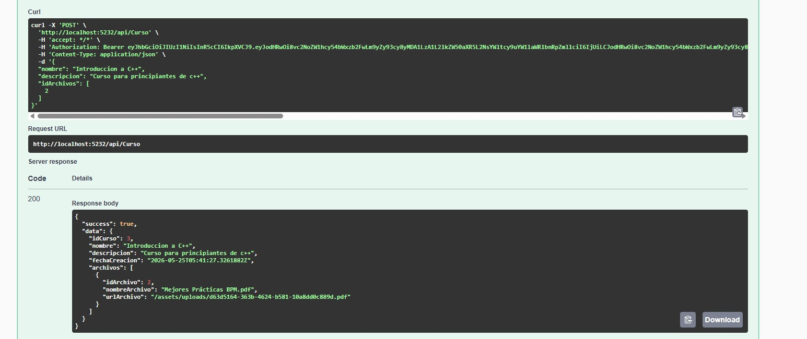

---

## Obtener curso por ID

```http
GET /api/Curso/{id}
```

### Descripción
Obtiene la información detallada de un curso específico.

## Captura
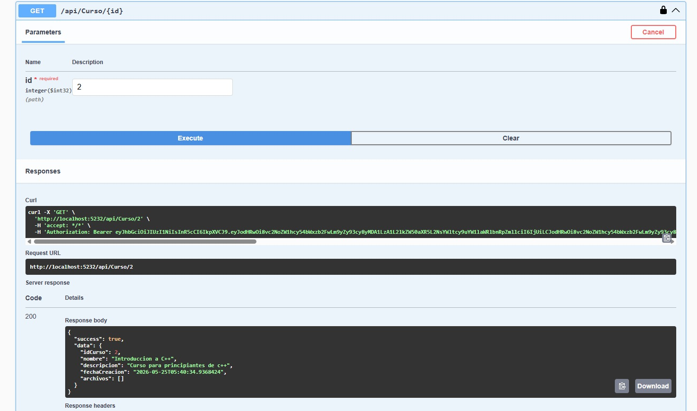

---

# 🧠 Módulo Flashcards

## Obtener flashcards por análisis

```http
GET /api/Flashcards?idAnalisis=1
```

### Descripción
Obtiene todas las flashcards asociadas a un análisis/archivo específico.

## Captura
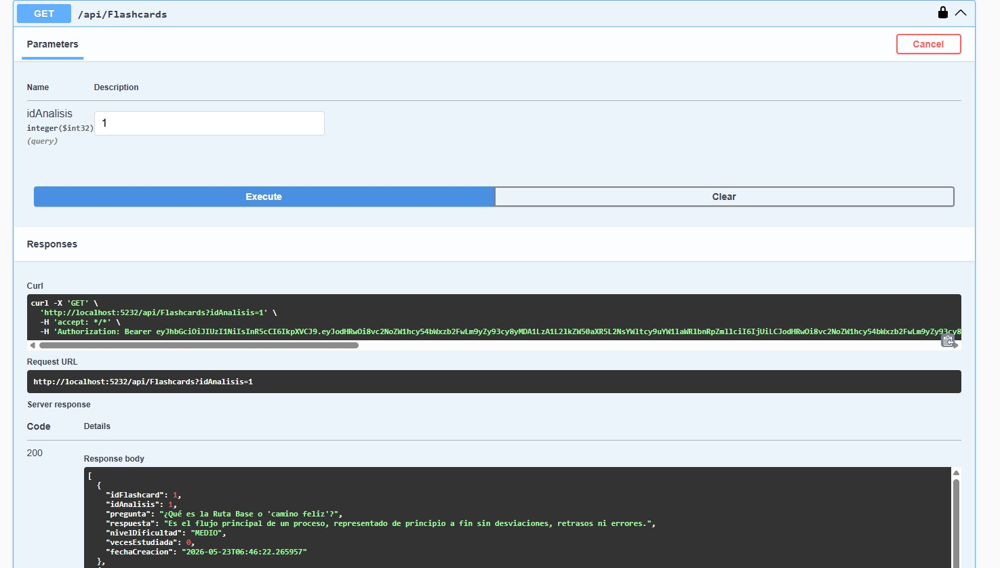

---

## Obtener todas las flashcards

```http
GET /api/Flashcards/todos
```

### Descripción
Obtiene todas las flashcards registradas en el sistema.

## Captura
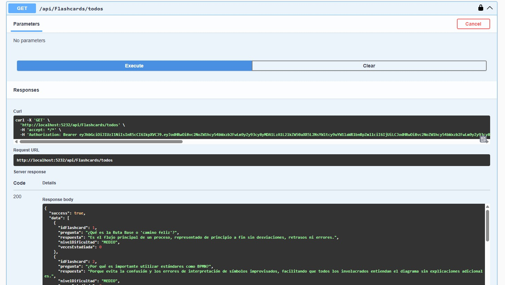

---

## Crear flashcard

```http
POST /api/Flashcards
```

### Descripción
Crea una nueva flashcard manualmente y la asocia a un análisis.

## Captura
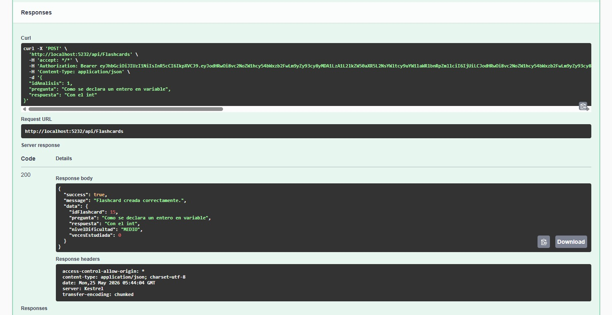

---

## Obtener flashcard por ID

```http
GET /api/Flashcards/{id}
```

### Descripción
Obtiene una flashcard específica mediante su ID.

## Captura
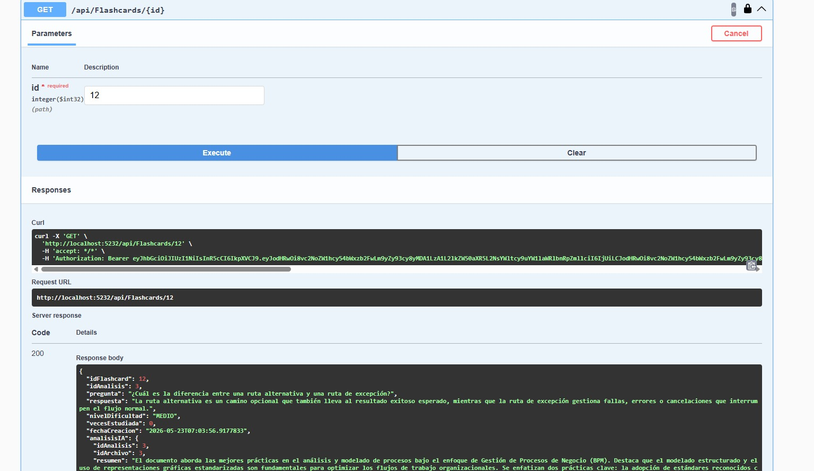

---

## Responder flashcard

```http
POST /api/Flashcards/responder
```

### Descripción
Registra la respuesta del usuario y guarda el progreso de estudio.

## Captura
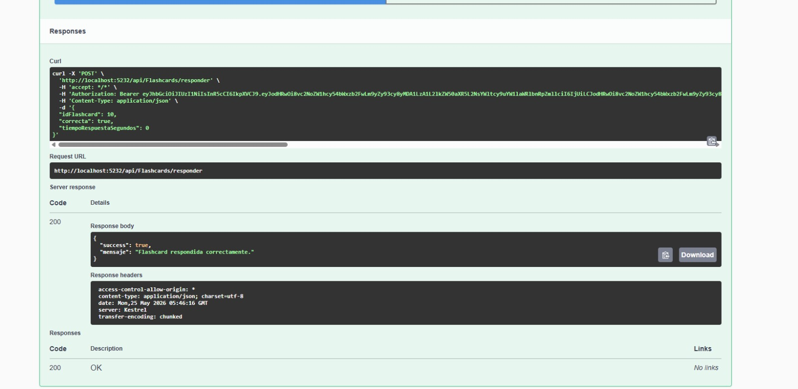

---

# 🧪 Módulo Quiz

## Obtener todos los quizzes

```http
GET /api/Quiz
```

### Descripción
Obtiene la lista de todos los quizzes registrados en el sistema.

## Captura
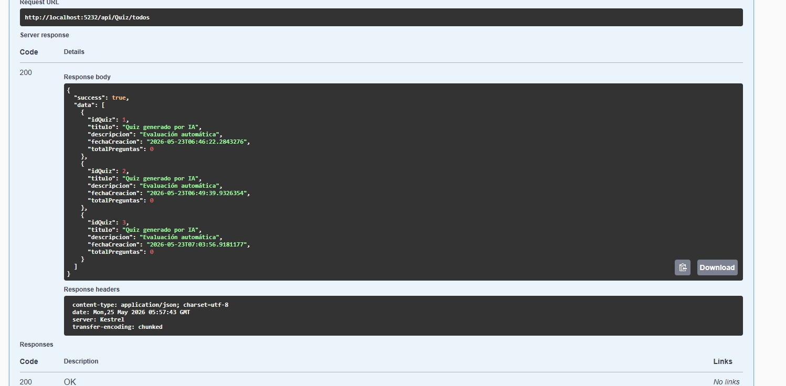

---

## Obtener quizzes por archivo

```http
GET /api/Quiz?idArchivo=1
```

### Descripción
Obtiene los quizzes asociados a un archivo específico.

## Captura
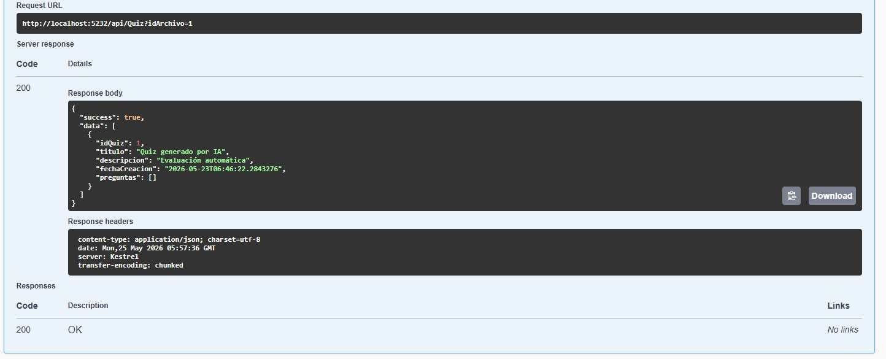

---

## Obtener quiz por ID

```http
GET /api/Quiz/{id}
```

### Descripción
Obtiene el detalle completo de un quiz específico.

## Captura
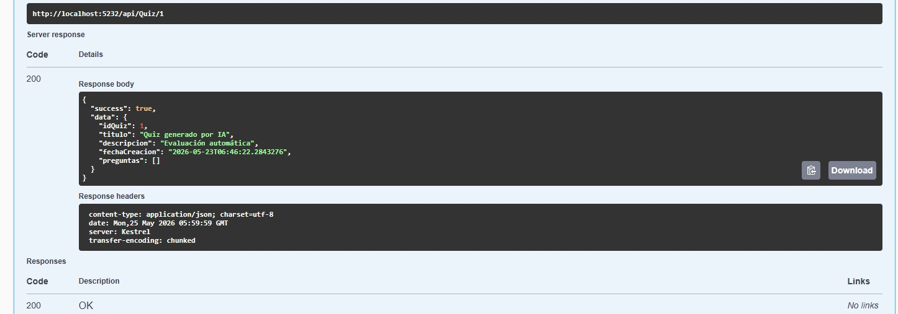

---

## Resolver quiz

```http
POST /api/Quiz/{id}/resolver
```

### Descripción
Registra la resolución de un quiz por parte del usuario autenticado.

## Captura
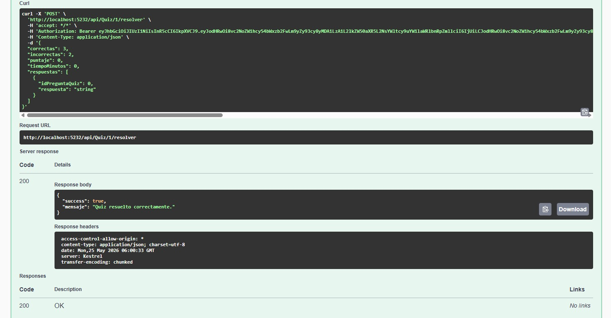

---

# 📊 Módulo Progreso

## Obtener progreso general

```http
GET /api/Progreso
```

### Descripción
Obtiene el progreso general del usuario autenticado.

## Captura
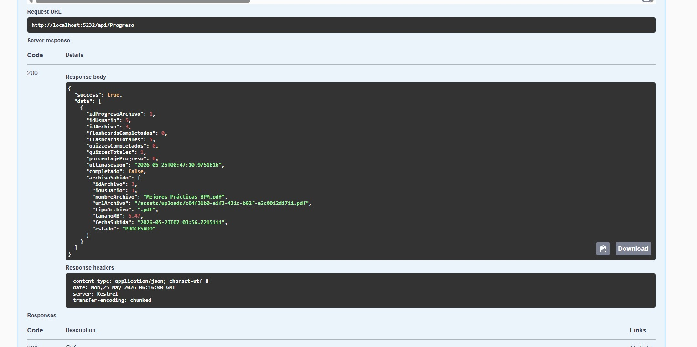

---

## Obtener progreso por archivo

```http
GET /api/Progreso/{idArchivo}
```

### Descripción
Obtiene el progreso detallado de un archivo específico.

## Captura
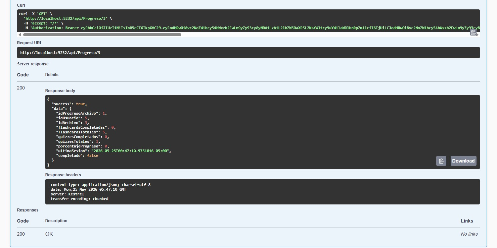

---

## Obtener promedio de quizzes

```http
GET /api/Progreso/{idArchivo}/promedio
```

### Descripción
Obtiene el promedio de quizzes del usuario autenticado.

## Captura
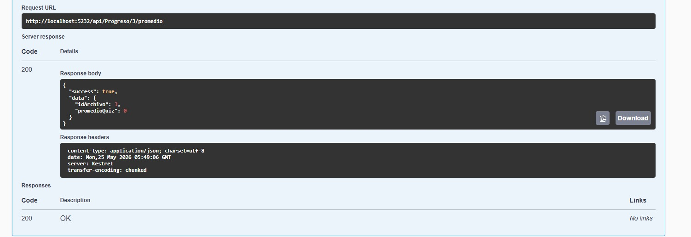

---

# 📈 Módulo Progreso Flashcards

## Obtener progreso de flashcard específica

```http
GET /api/ProgresoFlashcard/{idFlashcard}
```

### Descripción
Obtiene el progreso del usuario en una flashcard específica.

## Captura
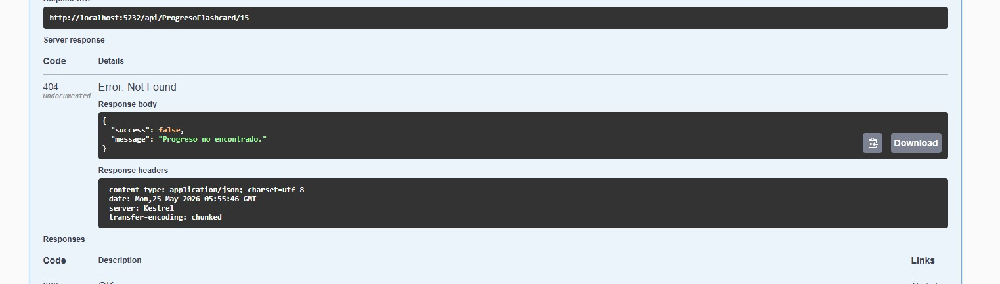

---

## Obtener todo el progreso de flashcards

```http
GET /api/ProgresoFlashcard
```

### Descripción
Obtiene todo el progreso de flashcards del usuario autenticado.

## Captura
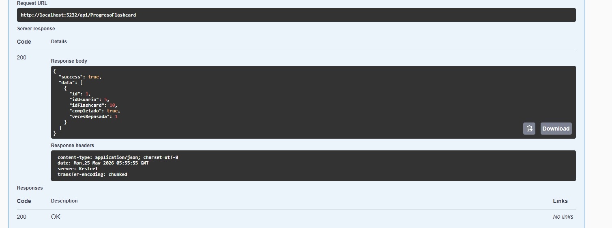

---

# 📊 Módulo Progreso Quiz

## Obtener progreso por quiz

```http
GET /api/ProgresoQuiz/{idQuiz}
```

### Descripción
Obtiene el progreso del usuario en un quiz específico.

## Captura
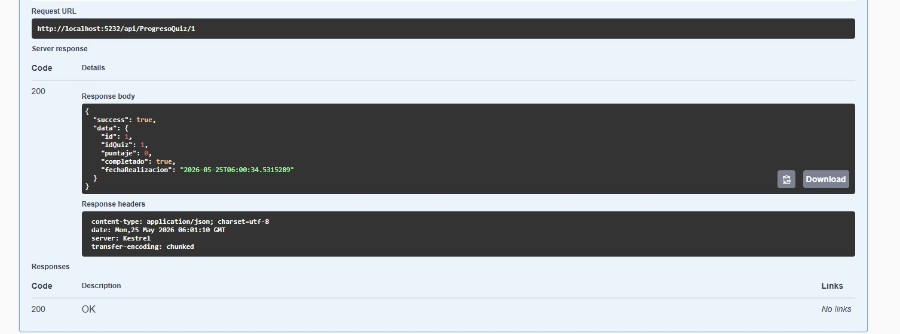

---

## Obtener historial de quizzes

```http
GET /api/ProgresoQuiz
```

### Descripción
Obtiene todo el historial de progreso de quizzes del usuario autenticado.

## Captura
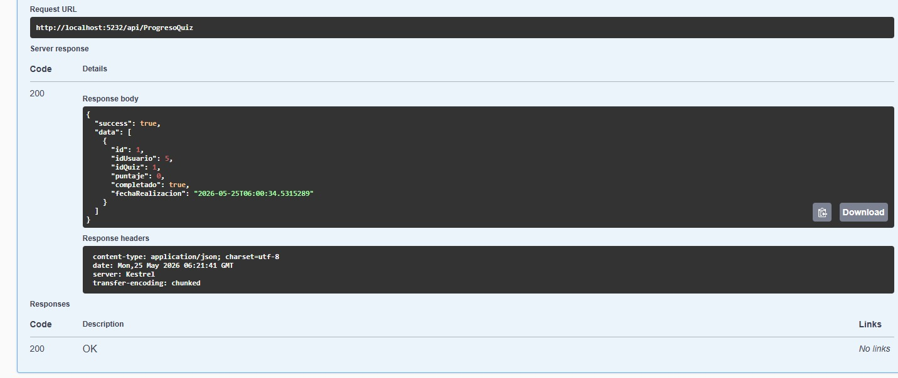

---

# ✅ Resultados de pruebas

| Endpoint | Estado |
|----------|--------|
| Cursos | ✅ OK |
| Flashcards | ✅ OK |
| Quiz | ✅ OK |
| Progreso | ✅ OK |
| JWT | ✅ OK |
| Swagger | ✅ OK |

---

# ⚙️ Tecnologías utilizadas

- ASP.NET Core 8
- Entity Framework Core
- SQL Server
- Swagger/OpenAPI
- JWT Authentication
- Docker
